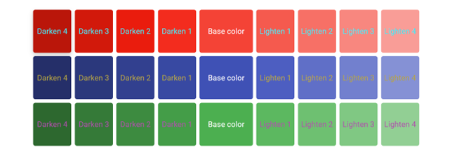
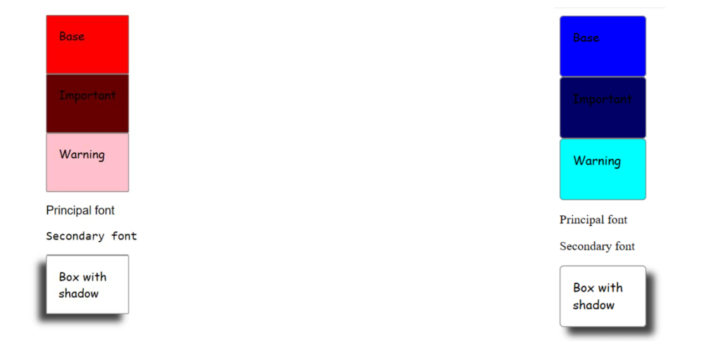

# Layout 01

The guide for Layout 01 execises can be download from [Exercises Layout01](https://campus.lemoncode.net/#/training/68077e45f00c2d5dcf088b4d/delivery-list/680790e2ef958e1c1b2100ce) as a authenticated user.

## Execise 1

Create a dynamic palette of colors similar to the above image.



Using the following **html** as a reference

```html
<div class="container-1"> 
    <div class="box darken-4"><span class="color-box-text">Darken 4</span></div> 
    <div class="box darken-3"><span class="color-box-text">Darken 3</span></div> 
    <div class="box darken-2"><span class="color-box-text">Darken 2</span></div> 
    <div class="box darken-1"><span class="color-box-text">Darken 1</span></div> 
    <div class="box base-color"><span class="color-box-text">Base color</span></div> 
    <div class="box lighten-1"><span class="color-box-text">Lighten 1</span></div> 
    <div class="box lighten-2"><span class="color-box-text">Lighten 2</span></div> 
    <div class="box lighten-3"><span class="color-box-text">Lighten 3</span></div> 
    <div class="box lighten-4"><span class="color-box-text">Lighten 4</span></div> 
</div> 

```

Review the [Readme](./exercise1/Readme.md) to see the instructions to run this exercise.

## Execise 2

Create a html page with *theme* support for some properties:

 - Color
 - Font
 - Border Radious
 - Shadow box

 

 > The theme can be changed modifying the source code not dynamically changed with js or any other method.

 Review the [Readme](./exercise2/Readme.md) to see the instructions to run this exercise.