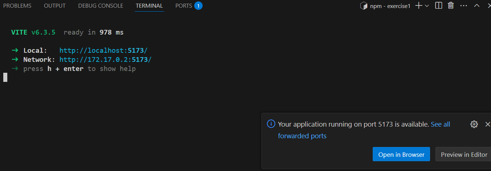

# Setup

Open the code using the **Reopen in Container** feature from *Dev Containers extension* in **VS Code**

# Install dependencies

To install dependencies execute the following command:

```bash
npm install
```

# Run

To run the project execute the following command and follow the link ```http://localhost:XXXX``` from the **VS Code Dev Containers** terminal or **Open in browser toast**.

```bash
npm run dev
```



# Test screen sizes

To test the responsive design you can:

 - Use developer tools or change the browser size
 - Use apps like 'https://responsively.app/' to test different screen sizes